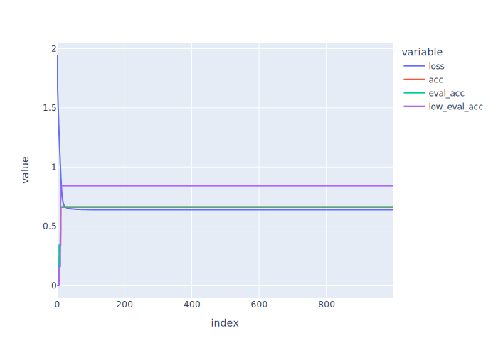

# Experiment: Boolean Function Training

## Objective

Learn how transformers with non-monotonic targets learn over two head dimensions, and ensure that we can interpret that behavior.

To do this, we define a language called Double Majority which takes two thresholds, $\alpha_1$ and $\alpha_2$, and contains strings of length $n$ for which the number of 1s is in the interval $[\alpha_1 n,\alpha_2 n]$.

## Transformer Model

Our transformer is a single layer, single attention head transformer with no MLP layer and no positional encoding. Thus, it consists of the following parameters: 

* Attention Head
    * $W_Q$: shape (head_dim, hidden_dim)
    * $W_K$: shape (head_dim, hidden_dim)
    * $W_V$: shape (head_dim, hidden_dim)
    * $W_O$: shape (hidden_dim, head_dim)

Given a bitstring $x$, we encode it as a (func_width, 3) sized matrix by one-hot encoding the binary vocabulary (with an extra token for the [CLS] token embedded at the beginning). As an example, the string 001101 would be encoded as the matrix

$$X = \begin{pmatrix}
0 & 1 & 1 & 0 & 0 & 1 & 1 \\ 
0 & 0 & 0 & 1 & 1 & 0 & 0 \\
1 & 0 & 0 & 0 & 0 & 0 & 0
\end{pmatrix}^T$$

Let $h$ be the head dimension (denoted head_dim below). After encoding, the attention head performs the following calculation to get the outut sequence 

$$
A = \text{softmax}\left(\dfrac{(XW_Q^T)(XQ_K^T)^T}{\sqrt{h}}\right)
$$

$$
Y = AXW_O^T
$$

$Y$ has shape (func_width, 3), so we just consider the output corresponding to the cls token (the first row), giving a 3 dimensional vector. The first two components of that vector are taken as the logits for the 0 class and 1 class, respectively. 

## Experiment Setup

To create a training and validation dataset for the transformer, we sampled bitstrings of a fixed length and annotated them with a binary classification target encoding whether more than half of the sampled bits in a string were 1. 

See the hyperparameters use for our experiment here:

| Hyperparamter | Value | Explanation |
| ------------- | ----- | ----------- |
| `lr`          | 0.01  | Learning Rate |
| `dataset_size`| 1000  | Number of bitstrings to sample |
| `func_width` | 20 | Length of bitstrings (functions) |
| `head_dim` | 1 | Hidden dim of each attention head of the transformer | 
| `num_epochs` | 300 | Number of epochs | 
| `train_frac` | 0.4 | Fraction of sampled dataset to be used for training (the rest will be used for testing) |
| `low_threshold` | 0.5 | Fraction of bits which must be 1 for label to change from 0 to 1
| `high_threshold` | 0.9 | Fraction of bits which must be 1 for label to change from 1 back to 0 |

## Training Results

As described above, we trained the model for `num_epochs` epochs 

As shown in the figure, the model quickly converges to perfect accuracy for both training and validation splits.

## Interpretation

Note only some of these numbers are consequential (i.e. only some are in the computational path of the network):

1. Only the query at index 2 matters because we are only reading from the output of the [CLS] token (token id 2).
2. As in any transformer, we can combine the w_k and w_v matrices because they always operate together. In this case that just comes down to elementwise multiplication because they are just vectors

Thus, we arrive at the following three parameters:
0.34, -0.31, -0.71. The first stage of the transformer can be represented as 
$$y_1 = 0.31n_0 +1.05 n_1+0.01n_{CLS},$$
$$y_2 = 0.65n_0 +0.49 n_1+0.03n_{CLS},$$

We know that $n_{CLS}=1$ and $n_0=20-n_1$, so we have 
$$y_1 = 0.31(20-n_1) +1.05 n_1 +0.01 $$
and 
$$y_2 = 0.65(20-n_1) +0.49 n_1 +0.03 $$'

Then, we get the logits
$$L_0 = -2.43y_1 - 0.44 y_1 $$
$$L_1 = 1.64y_1+1.60y_2

Still need to spell out a few details.