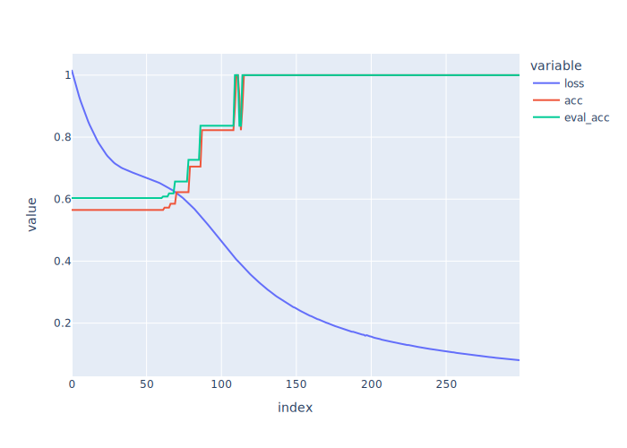
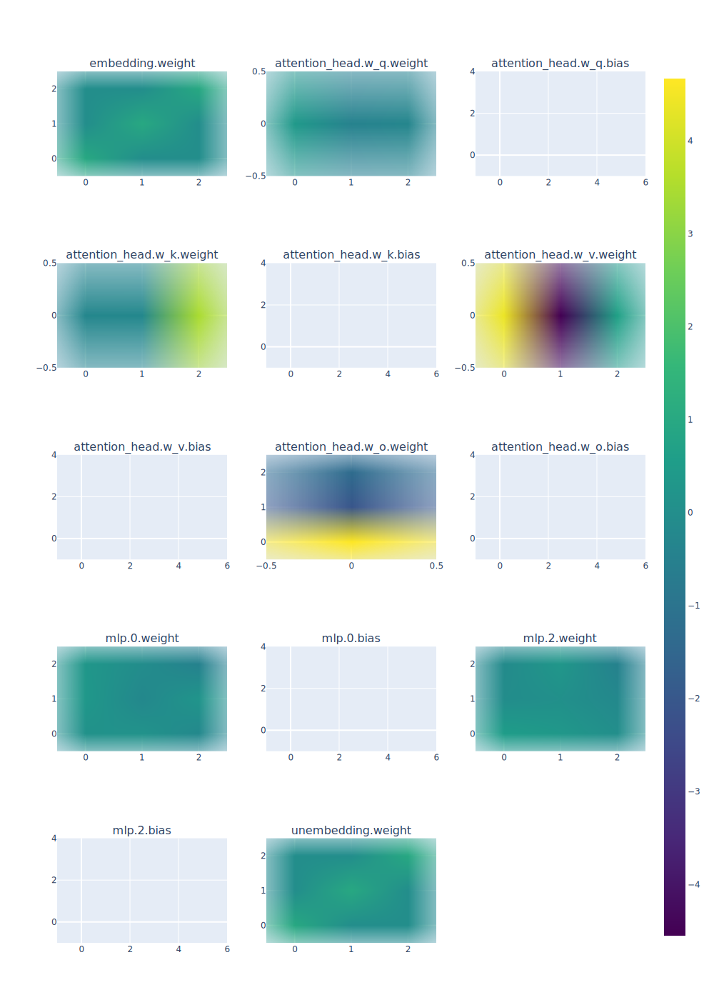

# Experiment: Boolean Function Training

## Objective

Train a very simple transformer to predict whether a bit string has over half of its bits as ones (whether it is in the formal language MAJORITY) to verify that our basic technique for interpreting transformer circuits works.

In other words, we should be able to see exactly why and how the transformer is outputting the results it outputs.

## Transformer Model

Our transformer is a single layer, single attention head transformer with no MLP layer and no positional encoding. Thus, it consists of the following parameters: 

* Attention Head
    * $W_Q$: shape (hidden_dim, head_dim)
    * $W_K$: shape (hidden_dim, head_dim)
    * $W_V$: shape (hidden_dim, head_dim)
    * $W_O$: shape (head_dim, hidden_dim)

Given a bitstring $x$, we encode it as a (func_width, 3) sized matrix by one-hot encoding the binary vocabulary (with an extra token for the [CLS] token embedded at the beginning). As an example, the string 001101 would be encoded as the matrix

$$X = \begin{pmatrix}
0 & 1 & 1 & 0 & 0 & 1 & 1 \\ 
0 & 0 & 0 & 1 & 1 & 0 & 0 \\
1 & 0 & 0 & 0 & 0 & 0 & 0
\end{pmatrix}^T$$

Let $h$ be the head dimensio (denoted head_dim below). After encoding, the attention head performs the following calculation to get the outut sequence 

$$
A = \text{softmax}\left(\dfrac{(XW_Q)(XW_K)^T}{\sqrt{h}}\right)
$$

$$
Y = AXW_O
$$

$Y$ has shape (func_width, 3), so we just consider the output corresponding to the cls token (the first row), giving a 3 dimensional vector. The first two components of that vector are taken as the logits for the 0 class and 1 class, respectively. 

## Experiment Setup

To create a training and validation dataset for the transformer, we sampled bitstrings of a fixed length and annotated them with a binary classification target encoding whether more than half of the sampled bits in a string were 1. 

See the hyperparameters use for our experiment here:

| Hyperparamter | Value | Explanation |
| ------------- | ----- | ----------- |
| `lr`          | 0.01  | Learning Rate |
| `dataset_size`| 1000  | Number of bitstrings to sample |
| `func_width` | 20 | Length of bitstrings (functions) |
| `head_dim` | 1 | Hidden dim of each attention head of the transformer | 
| `num_epochs` | 300 | Number of epochs | 
| `train_frac` | 0.4 | Fraction of sampled dataset to be used for training (the rest will be used for testing) |

## Training Results

As described above, we trained the model for `num_epochs` epochs 

As shown in the figure, the model quickly converges to perfect accuracy for both training and validation splits.

## Interpretation

Note only some of these numbers are consequential (i.e. only some are in the computational path of the network):

1. Only the query at index 2 matters because we are only reading from the output of the [CLS] token (token id 2).
2. As in any transformer, we can combine the w_k and w_v matrices because they always operate together. In this case that just comes down to elementwise multiplication because they are just vectors

Thus, we arrive at the following three parameters:
0.34, -0.31, -0.71. The first stage of the transformer can be represented as 
$$y = 0.34n_0 -0.31 n_1-0.71n_{CLS},$$
where $n_0$, $n_1$, and $n_{CLS}$ are the number of 0s, 1s and CLS tokens in the string. This takes advantage of the fact that our transformer has no positional embedding and is thus completely additive across input positions.

It is clear that this number is roughly positive when the bistring is not in majority and negative when the string is in majority. The final stage is multiplication by the $W_O$ matrix, which gives a higher logit for 0 when its input scalar is positive and a higher logit for 1 when its input scalar is negative, consistent with the previous sentence. Thus, we have fully understood the transfromer's mechanism.